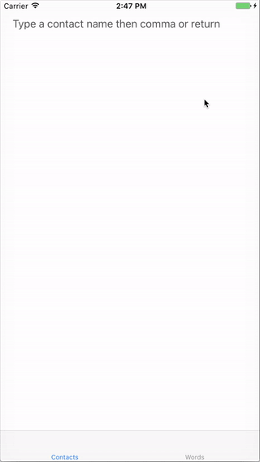

## KSOToken

*KSOToken* is an iOS framework containing classes the mirror the functionality provided by `NSTokenField` on macOS. It provides completion support and its appearance is highly customizable. It relies on the [Stanley](https://github.com/Kosoku/Stanley) and [Ditko](https://github.com/Kosoku/Ditko), and [Loki](https://github.com/Kosoku/Loki) frameworks.

### Installation

You can install *KSOToken* using [cocoapods](https://cocoapods.org/), [Carthage](https://github.com/Carthage/Carthage), or as a framework. When installing as a framework, ensure you also link to [Stanley](https://github.com/Kosoku/Stanley), [Loki](https://github.com/Kosoku/Loki) and [Ditko](https://github.com/Kosoku/Ditko) as *KSOToken* relies on them.

### Dependencies

Third party:

- [Stanley](https://github.com/Kosoku/Stanley)
- [Loki](https://github.com/Kosoku/Loki)
- [Ditko](https://github.com/Kosoku/Ditko)